# AI/SW 개발 워크스테이션 구축 과제
<p>
   
   
   
   
</p>

<br>

## 1. 프로젝트 개요
- 목표: 도커를 이용한 로컬 개발 환경 구축 및 웹 서버 컨테이너화

<br>

## 2. 실행 환경
- OS: macOS (OrbStack)
- Shell: zsh
- Docker Version: 28.5.2
- Git Version: 2.53.0

<br>

## 3. 수행항목 체크리스트
- [x] 터미널 기초 실습 및 로그 기록
- [x] 파일 권한(755, 644) 실습
- [x] Docker 설치 및 hello-world 확인
- [x] Dockerfile 작성 및 커스텀 이미지 빌드
- [x] 포트매핑 및 볼륨 설정
- [x] Github 연동 완료

<br>

## 4. 트러블슈팅
### [Issue #1] git push rejected 및 pull divergent
* **문제:** 로컬 작업 후 `push`를 시도했으나 `[rejected]` 에러가 발생하며 거절당함.
* **원인가설:** 웹에서도 수정했기 때문에, 원격 저장소에 로컬에 없는 커밋이 생겨 이력이 어긋났을 것으로 추측. `pull`을 하면 해결될 것이라 예상함.
* **확인:** `pull`을 실행했으나 `fatal: Need to specify how to reconcile divergent branches` 메시지가 출력됨. 깃이 두 갈래로 갈라진 이력을 합치는 방법(Merge 또는 Rebase)을 정해주지 않아 멈춘 것을 확인.
* **해결:** 이력을 하나로 묶어주는 **Merge** 방식을 쓰기 위해 `pull.rebase false` 설정을 적용함. 이후 다시 `pull`을 수행하여 `Merge made by the 'ort' strategy` 메시지와 함께 이력을 성공적으로 합침.
> 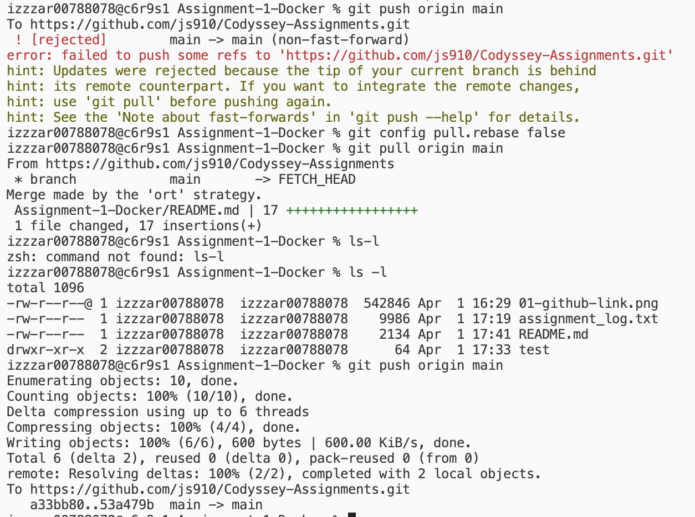

### [Issue #2] 컨테이너 네트워크 설정 오류
* **문제:** docker run 실행 시 port is already allocated 에러와 함께 컨테이너 생성 실패.
* **원인가설:** 이전 실습에서 포트를 점유하고 있는 컨테이너가 존재함.
* **확인:** docker ps를 통해 현재 8080 포트가 활성화 상태임을 검증함.
* **해결 및 대안:** 기존 컨테이너를 강제로 끄지 않고 새로운 실습을 병행하기 위해, 중복되지 않는 8081 포트를 할당함.
> 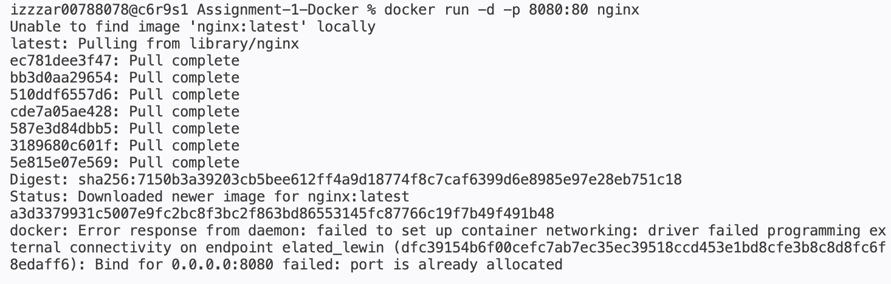

<br>

## 5. 터미널 조작 로그
### 1) Git 설정 확인
> 
```bash
izzzar00788078@c6r9s1 Assignment-1-Docker % git config --global user.name "js910"
izzzar00788078@c6r9s1 Assignment-1-Docker % git config --global user.email "jysong0914@gmail.com"
izzzar00788078@c6r9s1 Assignment-1-Docker % git config --list
credential.helper=osxkeychain
user.name=js910
user.email=jysong0914@gmail.com
core.repositoryformatversion=0
core.filemode=true
core.bare=false
core.logallrefupdates=true
core.ignorecase=true
core.precomposeunicode=true
remote.origin.url=https://github.com/js910/Codyssey-Assignments.git
remote.origin.fetch=+refs/heads/*:refs/remotes/origin/*
branch.main.remote=origin
branch.main.merge=refs/heads/main
```
### 2) 터미널 실습 로그
본 실습은 `script` 명령어를 통해 기록되었으며, 주요 수행 내역은 다음과 같습니다.

1. **디렉토리 생성 및 이동**
   - `mkdir test`: 실습용 디렉토리 생성
   - `ls -la`: 숨김 파일을 포함한 전체 목록 및 권한 확인
   - `cd test`: 디렉토리 진입

2. **파일 생성 및 권한 변경 (`chmod`)**
   - `touch sample.txt`: 빈 파일 생성
   - `chmod 755 sample.txt`: 실행 권한 부여 (rwxr-xr-x)
   - `chmod 644 sample.txt`: 읽기/쓰기 권한으로 복구 (rw-r--r--)

> #### 권한 숫자 계산법
> 
> 권한은 4(읽기), 2(쓰기), 1(실행)의 조합으로 구성
>
> | 숫자 | 권한 (rwx) | 디렉토리에서의 의미 |
> | :--- | :--- | :--- |
> | **7** | `rwx` | 읽기, 쓰기, **접근(cd)** 모두 가능 |
> | **5** | `r-x` | 읽기 및 **접근(cd)** 가능 (일반적) |
> | **4** | `r--` | 목록만 확인 가능 (**접근 불가**) |
>
> **주의사항**
> * **`-R` 옵션:** 디렉토리 내부 모든 파일에 일괄 적용할 때 사용
> * **홀수 권한:** 디렉토리는 실행 권한(+1)이 있어야 `cd`로 입장 가능

3. **파일 관리 (`cp`, `mv`, `rm`)**
   - `cp sample.txt backup.txt`: 파일 복사
   - `mv backup.txt renamed.txt`: 파일 이름 변경
   - `rm sample.txt`: 원본 파일 삭제

> **Note:** 상세 실행 로그는 [assignment_log.txt](./assets/assignment_log.txt) 파일에서 확인 가능합니다.

3. **절대경로 상대경로**
* **절대경로:** 루트(/) 로부터의 고정 주소
* **상대경로:** 현재 작업 디렉토리 기준 경로

<br>

## 6. Docker 운영/검증 로그

### 1) Docker 설치 및 점검
* **버전 맟 서버 정보 (`docker --version`, `docker info`)**

  

* **운영 상태 통합 확인 (`images`, `ps -a`, `logs`, `stats`)**

  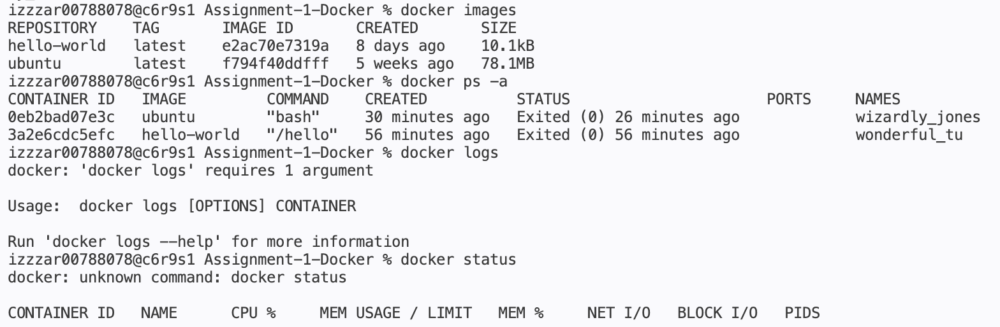

  > `docker images`와 `ps -a`를 통해 로컬 이미지 목록과 컨테이너 실행 이력을 확인하였으며, `logs`와 `stats` 명령어로 컨테이너의 내부 출력 기록 및 실시간 자원 사용률을 검증함.

* **Hello-World 구동**

  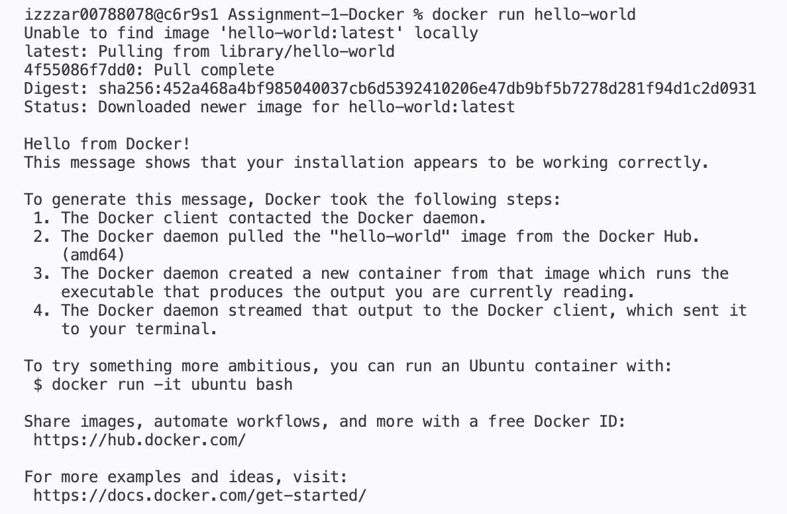

### 2) Ubuntu 컨테이너 실습 분석
* **컨테이너 내부 진입 및 명령어(`ls`, `echo`) 수행**

  

* **컨테이너 유지 방식 관찰 정리**
  > | 구분 | 특징 | 컨테이너 유지 여부 |
  > | :--- | :--- | :--- |
  > | **run -it** | 컨테이너 생성과 동시에 터미널을 연결 | `exit` 시 컨테이너도 함께 **종료** |
  > | **exec** | 실행 중인 곳에 **새 프로세스** 실행 | `exit` 후에도 컨테이너 **유지** |
  > | **attach** | 실행 중인 **기존 프로세스**에 연결 | `exit` 시 컨테이너가 **정지**될 수 있음. |

<br>

## 7. Dockerfile 기반 웹 서버 컨테이너

### 1) 커스텀 이미지 빌드 및 실행
`Dockerfile`을 작성하여 Nginx:alpine 베이스 이미지에 직접 제작한 `index.html`을 포함시킨 커스텀 이미지를 생성

* **Dockerfile 작성**
  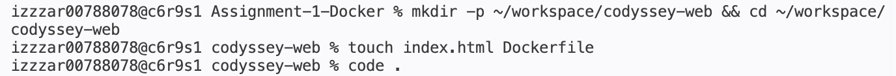

* **이미지 빌드 및 컨테이너 실행 확인 (`docker build`, `docker ps`)**
  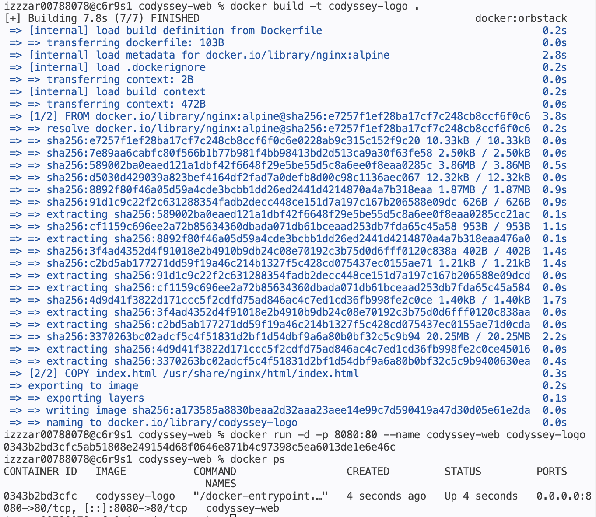

  > * `docker ps`: 8080 포트가 매핑된 `codyssey-web` 컨테이너가 `Up` 상태임을 검증.
  
### 2) 서비스 접속 확인 (Port Mapping)
브라우저를 통해 호스트의 8080 포트로 접속하여 컨테이너 내부에서 서비스 중인 웹 페이지가 정상 출력되는지 확인

* **브라우저 접속 결과**
  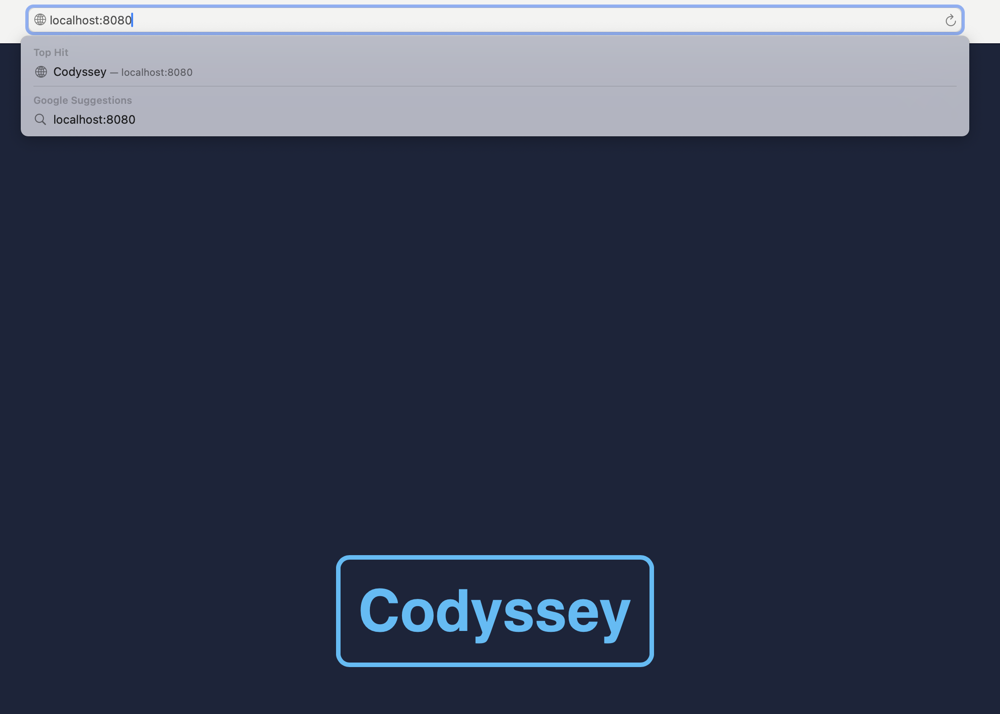

<br>

## 8. 코드 동기화 및 데이터 영속성

### 1) Bind Mount
호스트의 작업 디렉토리를 컨테이너와 연결하여, 이미지 재빌드 없이 소스 수정을 실시간으로 반영

  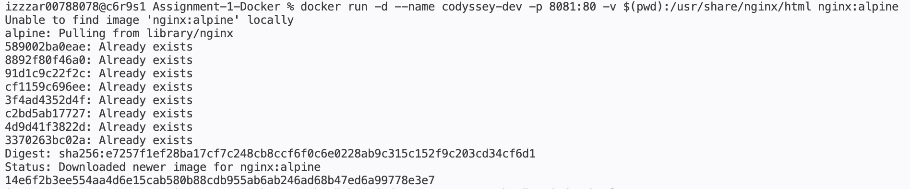
  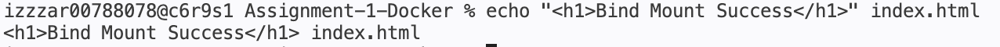

* **브라우저 접속 결과**
   > 빌드 과정 없이 echo 명령만으로 localhost:8081의 화면이 바뀐 것을 확인

   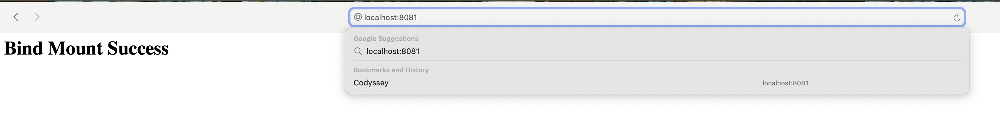

### 2) Docker Volume
컨테이너는 삭제되면 내부 데이터가 사라지는 휘발성 문제를 해결하기 위해, Docker Volume을 생성하여 컨테이너 삭제 후에도 데이터가 보존되는 **영속성**을 검증함.

  > * `docker images`: 생성된 `codyssey-logo` 이미지 확인.

  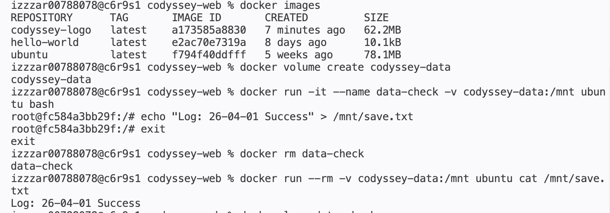

| 단계 | 작업 내용 | 명령어/결과 확인 |
| :--- | :--- | :--- |
| **1단계** | 데이터 볼륨 생성 및 파일 기입 | `docker volume create codyssey-data` |
| **2단계** | 컨테이너 강제 삭제 | `docker rm data-check` |
| **3단계** | 데이터 복구 및 영속성 확인 | `cat /mnt/save.txt` → **Success 확인** |

<br>

## 9. Github 설정 및 연동 증거

* **Repository 주소:** [https://github.com/js910/Codyssey-Assignments](https://github.com/js910/Codyssey-Assignments)

   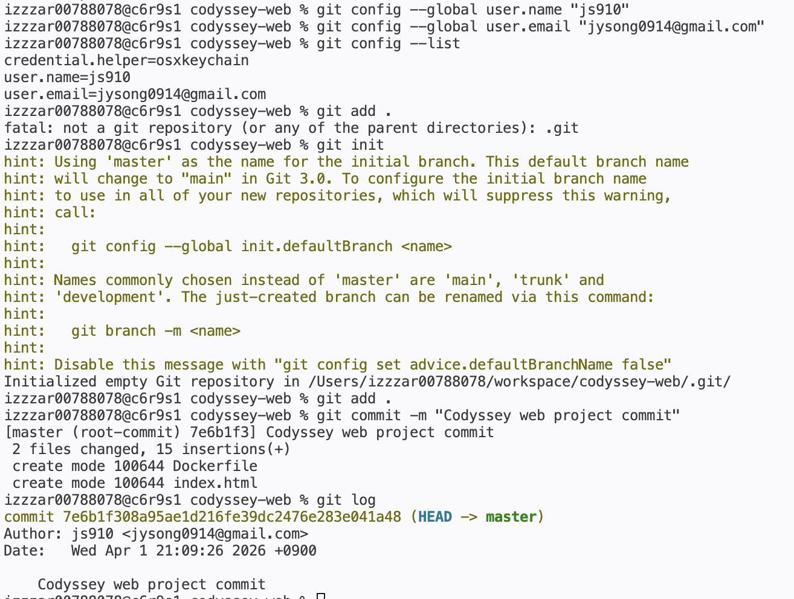

<br>

## 10. 구조적 원칙 및 설계 고찰
실습을 통해 확인한 Docker의 설계 원칙은 다음과 같습니다.

#### 1. 이미지와 컨테이너의 분리
* 이미지는 변경 불가능한 **설계도**이며, 컨테이너는 이 설계도를 기반으로 실행됩니다.
* 이 구조는 **환경 불일치 문제를 해결**하며, 배포의 신뢰성을 보장합니다.

#### 2. 격리된 실행 환경
* 컨테이너는 호스트 OS를 공유하지만, 파일 시스템과 네트워크는 격리되어 운영됩니다.
* 이는 서로 다른 버전의 라이브러리를 사용하는 서비스를 하나의 서버에서 **충돌 없이 운영**할 수 있습니다.

#### 3. 포트 매핑 및 데이터 영속성
* 컨테이너 내부 자원(포트)을 호스트 자원과 연결해 사용합니다.
* **Port Mapping**: 내부 설정을 수정하지 않고도 외부 접속 경로를 유연하게 운영합니다.
* **데이터 영속성**: 컨테이너는 삭제 및 교체가 가능합니다. 따라서 보존이 필요한 데이터는 **Volume**에 저장해 데이터를 안전하게 유지합니다.

**결론적으로, Docker는 애플리케이션을 환경으로부터 독립시켜 표준화된 방식으로 관리하게 해주는 클라우드 인프라의 핵심 기술임을 확인하였습니다.**

> **(추가)** Git: 내 컴퓨터(로컬)에서 코드의 변화를 기록하고 관리하는 도구, Github: Git으로 관리한 기록을 클라우드에 올려서 다른 사람과 공유하고 협업하는 플랫폼

> **(추가)** OrbStack: Docker Desktop 대비 가볍고 빠른 실행 속도를 제공하며, 별도의 `sudo` 권한 없이도 컨테이너를 관리할 수 있음.