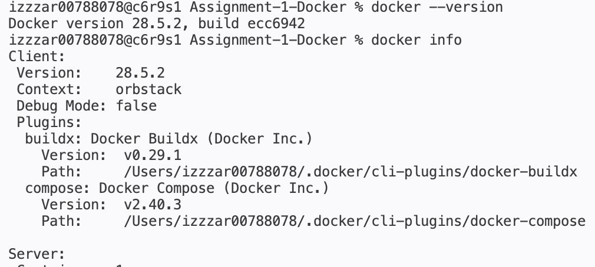
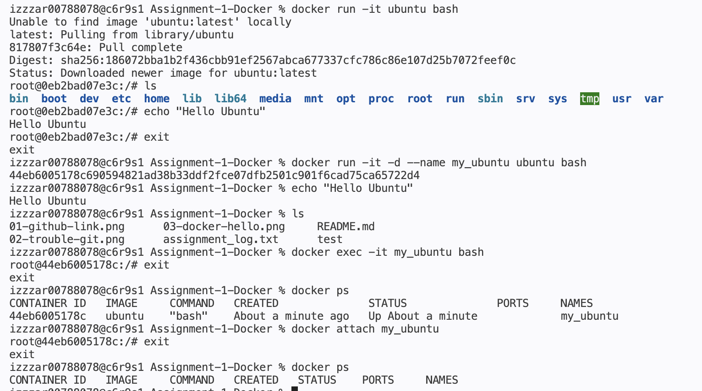

# AI/SW 개발 워크스테이션 구축 과제


<br>

## 1. 프로젝트 개요
- 목표: 도커를 이용한 로컬 개발 환경 구축 및 웹 서버 컨테이너화

<br>

## 2. 실행 환경
- OS: macOS (OrbStack)
- Shell: zsh
- Docker Version: 28.5.2
- Git Version: (나중에 채우기)

<br>

## 3. 수행항목 체크리스트
- [x] 터미널 기초 실습 및 로그 기록
- [x] 파일 권한(755, 644) 실습
- [x] Docker 설치 및 hello-world 확인
- [ ] Dockerfile 작성 및 커스텀 이미지 빌드
- [ ] 포트매핑 및 볼륨 설정
- [ ] Github 연동 완료

<br>

## 4. 트러블슈팅
### [Issue] git push rejected & pull divergence
* **문제:** 로컬 작업 후 `push`를 시도했으나 `[rejected]` 에러가 발생하며 거절당함.
* **원인가설:** 웹에서도 수정했기 때문에, 원격 저장소에 로컬에 없는 커밋이 생겨 이력이 어긋났을 것으로 추측. `pull`을 하면 해결될 것이라 예상함.
* **확인:** `pull`을 실행했으나 `fatal: Need to specify how to reconcile divergent branches` 메시지가 출력됨. 깃이 두 갈래로 갈라진 이력을 합치는 방법(Merge 또는 Rebase)을 정해주지 않아 멈춘 것을 확인.
* **해결:** 이력을 하나로 묶어주는 **Merge** 방식을 쓰기 위해 `pull.rebase false` 설정을 적용함. 이후 다시 `pull`을 수행하여 `Merge made by the 'ort' strategy` 메시지와 함께 이력을 성공적으로 합침.
> 

<br>

## 5. 터미널 조작 로그
### 1) Git 설정 확인
> 
```bash
izzzar00788078@c6r9s1 Assignment-1-Docker % git config --global user.name "js910"
izzzar00788078@c6r9s1 Assignment-1-Docker % git config --global user.email "jysong0914@gmail.com"
izzzar00788078@c6r9s1 Assignment-1-Docker % git config --list
credential.helper=osxkeychain
user.name=js910
user.email=jysong0914@gmail.com
core.repositoryformatversion=0
core.filemode=true
core.bare=false
core.logallrefupdates=true
core.ignorecase=true
core.precomposeunicode=true
remote.origin.url=https://github.com/js910/Codyssey-Assignments.git
remote.origin.fetch=+refs/heads/*:refs/remotes/origin/*
branch.main.remote=origin
branch.main.merge=refs/heads/main
```
### 2) 터미널 실습 로그
본 실습은 `script` 명령어를 통해 기록되었으며, 주요 수행 내역은 다음과 같습니다.

1. **디렉토리 생성 및 이동**
   - `mkdir test`: 실습용 디렉토리 생성
   - `cd test`: 디렉토리 진입

2. **파일 생성 및 권한 변경 (`chmod`)**
   - `touch sample.txt`: 빈 파일 생성
   - `chmod 755 sample.txt`: 실행 권한 부여 (rwxr-xr-x)
   - `chmod 644 sample.txt`: 읽기/쓰기 권한으로 복구 (rw-r--r--)

> #### 권한 숫자 계산법
> 
> 권한은 4(읽기), 2(쓰기), 1(실행)의 조합으로 구성
>
> | 숫자 | 권한 (rwx) | 디렉토리에서의 의미 |
> | :--- | :--- | :--- |
> | **7** | `rwx` | 읽기, 쓰기, **접근(cd)** 모두 가능 |
> | **5** | `r-x` | 읽기 및 **접근(cd)** 가능 (일반적) |
> | **4** | `r--` | 목록만 확인 가능 (**접근 불가**) |
>
> **주의사항**
> * **`-R` 옵션:** 디렉토리 내부 모든 파일에 일괄 적용할 때 사용
> * **홀수 권한:** 디렉토리는 실행 권한(+1)이 있어야 `cd`로 입장 가능

3. **파일 관리 (`cp`, `mv`, `rm`)**
   - `cp sample.txt backup.txt`: 파일 복사
   - `mv backup.txt renamed.txt`: 파일 이름 변경
   - `rm sample.txt`: 원본 파일 삭제

> **Note:** 상세 실행 로그는 [assignment_log.txt](./assignment_log.txt) 파일에서 확인 가능합니다.

<br>

## 6. Docker 운영/검증 로그

### 1) Docker 설치 및 점검
* **버전 맟 서버 정보 (`docker --version`, `docker info`)**
  

* **운영 상태 통합 확인 (`images`, `ps -a`, `logs`, `stats`)**
  
  > `docker images`와 `ps -a`를 통해 로컬 이미지 목록과 컨테이너 실행 이력을 확인하였으며, `logs`와 `stats` 명령어로 컨테이너의 내부 출력 기록 및 실시간 자원 사용률을 검증함.

* **Hello-World 구동**
  

### 2) Ubuntu 컨테이너 실습 분석
* **컨테이너 내부 진입 및 명령어(`ls`, `echo`) 수행**
  

* **컨테이너 유지 방식 관찰 정리**
  > | 구분 | 특징 | 컨테이너 유지 여부 |
  > | :--- | :--- | :--- |
  > | **run -it** | 컨테이너 생성과 동시에 터미널을 연결 | `exit` 시 컨테이너도 함께 **종료** |
  > | **exec** | 실행 중인 곳에 **새 프로세스** 실행 | `exit` 후에도 컨테이너 **유지** |
  > | **attach** | 실행 중인 **기존 프로세스**에 연결 | `exit` 시 컨테이너가 **정지**될 수 있음. |

<br>

