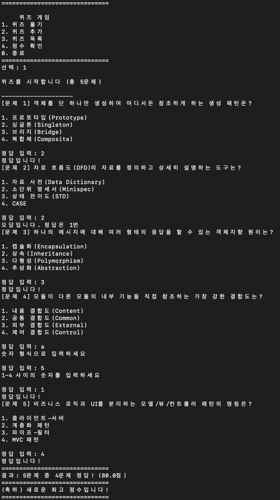
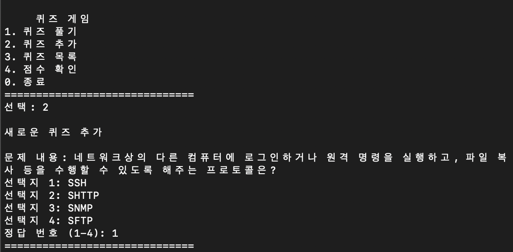
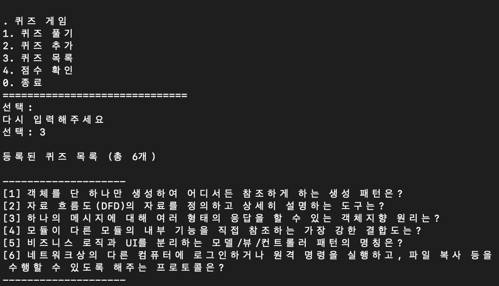
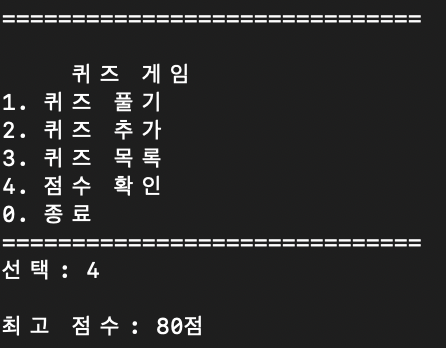
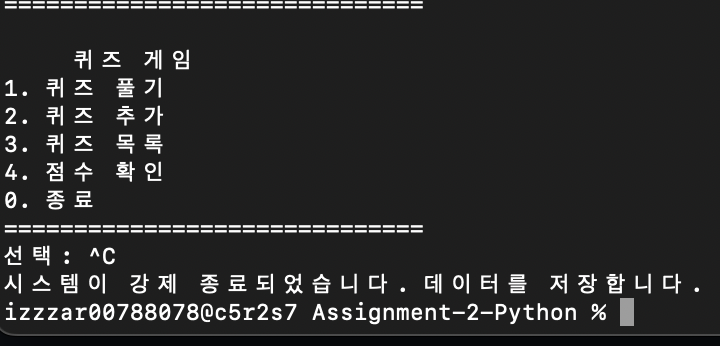
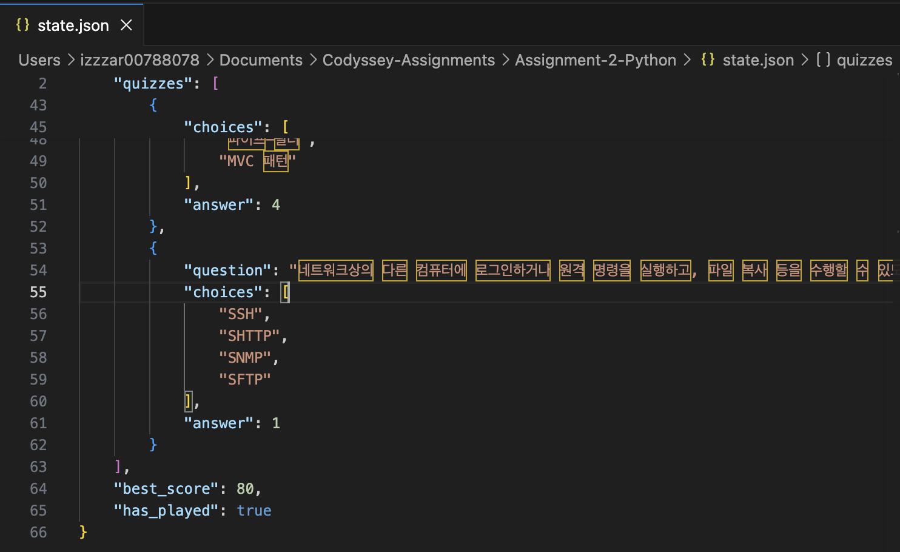
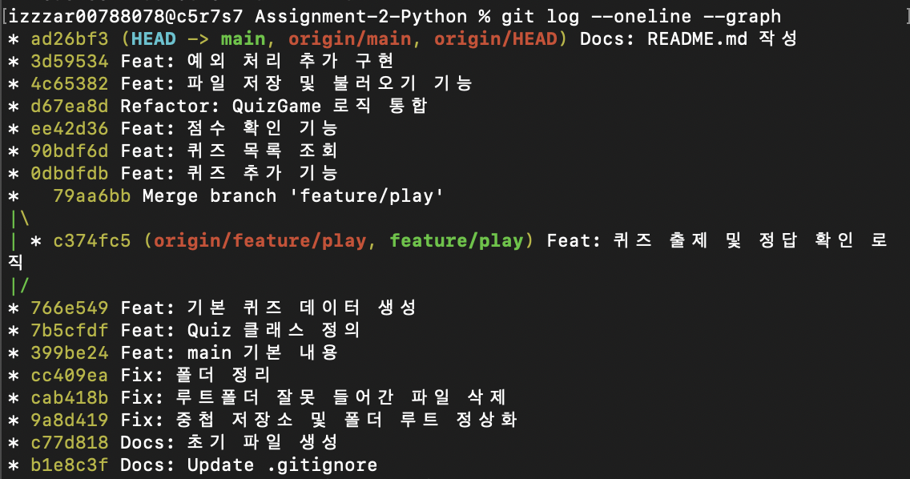
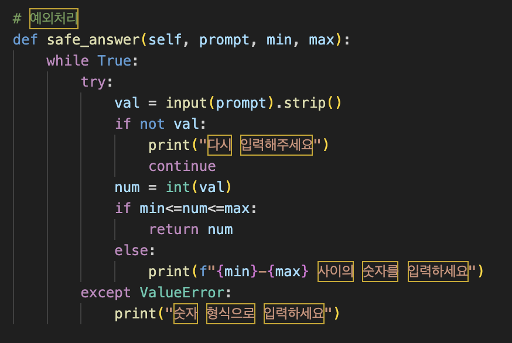
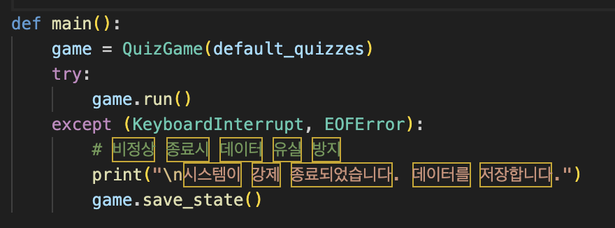

# Python 퀴즈 게임
<p>
   
   
   
</p>

## 1. 프로젝트 개요
- 본 프로젝트는 파이썬 기초 문법과 객체지향 설계(OOP), 그리고 JSON을 활용한 데이터 저장 기능을 학습하기 위해 개발된 터미널 기반 퀴즈 게임입니다.

<br>

## 2. 실행 환경
- Python Version: 3.12.13 (VS Code)
- Git Version: 2.53.0
- Shell: zsh

<br>

## 3. 퀴즈 주제 및 선정 이유
- **퀴즈 주제**: 정보처리기사 (소프트웨어 설계 및 구축)
- **선정 이유**: 전공 필수 지식인 소프트웨어 공학의 핵심 개념을 복습하고 객체지향 원리를 코드로 직접 실습하기 위해 선정함

<br>

## 4. 실행 방법
```bash
# 1. 저장소 클론
git clone https://github.com/js910/Codyssey-Assignments

# 2. 폴더 이동
cd Codyssey-Assignments/Assignment-2-Python

# 3. 프로그램 실행
python main.py
```

<br>

## 5. 기능 목록
#### 1) 퀴즈 풀기: 저장된 문제를 출제하고 정답 여부를 체크하여 점수를 계산
> 

#### 2) 퀴즈 추가: 사용자로부터 문제, 4개의 선택지, 정답 번호를 입력받아 state.json에 저장
> 

#### 3) 목록 조회: 현재 시스템에 등록된 전체 퀴즈 리스트를 확인
> 

#### 4) 점수 확인: 플레이 기록 중 최고 점수를 불러와 출력
> 

#### 5) 예외 처리: 숫자 변환 오류, 범위 초과, 빈 값 입력 등을 try-except로 방어하며, Ctrl+C 및 EOFError 발생 시에도 안전하게 자동 저장 후 종료
> 

<br>

## 6. 파일 구조
- `main.py`: 프로그램 진입점 및 메인 메뉴 루프 실행.
- `game.py`: QuizGame 클래스 (퀴즈 풀기, 추가, 목록, 파일 저장/로드 로직 관리).
- `data.py`: Quiz 클래스 (개별 퀴즈 객체 모델링 및 정답 검증).
- `state.json`: 데이터 영속성을 위한 JSON 포맷 저장 파일 (UTF-8).

<br>

## 7. 데이터 파일 설명 (state.json)
- **경로**: 프로젝트 루트 (`./state.json`)
- **역할**: 퀴즈 데이터와 사용자 최고 점수를 통합 관리
- **스키마**:
  - `quizzes`: 문제(question), 보기(choices), 정답(answer) 정보를 담은 객체 리스트
  - `best_score`: 최고 정답률 숫자 데이터
  - `has_played`: 게임 실행 여부를 판단 (Boolean)
  

<br>

## 8. Git 저장소 복제 및 동기화 실습
브랜치 병합 및 `clone`과 `pull` 명령어를 익히기 위해 아래 절차를 수행하였습니다.
- **브랜치 병합**: `feature/play` 브랜치 작업 후 `main` 병합
- **동기화**: 별도 디렉터리에서 `git clone`, 수정 후 `commit` -> `push`
            기존 로컬 작업 디렉터리에서 `pull`을 통해 변경사항 동기화 완료


<br>

## 9. 예외 처리 상세 설계
사용자의 비정상적인 입력에도 프로그램이 중단되지 않도록 다음과 같이 설계하였습니다.
- **입력 검증**: 공백 제거(`strip()`), 숫자 변환(`int()`) 실패 시 `ValueError` 처리 및 재입력 유도
- **범위 검증**: 메뉴/정답 번호가 지정된 범위를 벗어날 경우 안내 메시지 출력
- **강제 종료 대응**: `KeyboardInterrupt` 및 `EOFError` 발생 시 `state.json` 저장 후 안전하게 종료
- **파일 복구**: `state.json`이 삭제되었거나 손상된 경우, 기본 데이터셋으로 복구


<br>

## 10. 랜덤 함수
파이썬의 random 모듈을 사용하여 무작위 값을 생성하거나 데이터를 뒤섞는 방법입니다.
```python
import random
```

| 함수 | 설명 | 특징 |
| :--- | :--- | :--- |
| `random()` | 0.0 이상 1.0 미만 실수 선택 | 0.0 <= x < 1.0 |
| `randint(a, b)` | a 이상 b 이하 정수 선택 | **마지막 숫자 b 포함** |
| `choice(list)` | 리스트에서 요소 하나를 무작위 선택 | 단일 값 반환 |
| `sample(list, k)` | 리스트에서 중복 없이 k개를 선택 | 원본 보존, 새 리스트 반환 |
| `shuffle(list)` | 리스트의 순서를 그 자리에서 뒤섞음 | **원본 변형** |