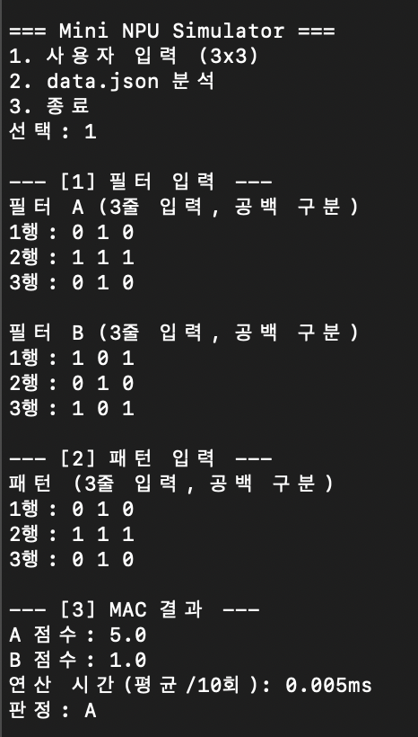
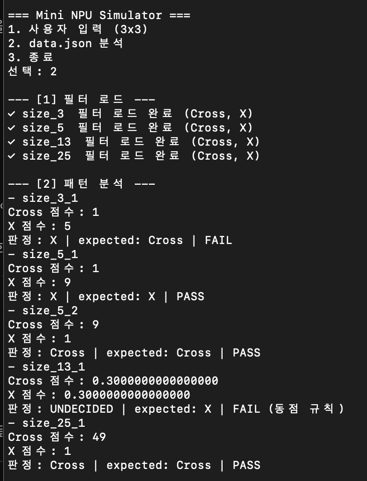
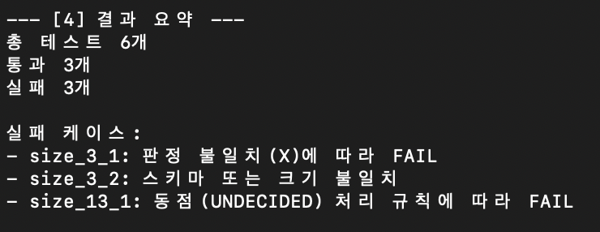
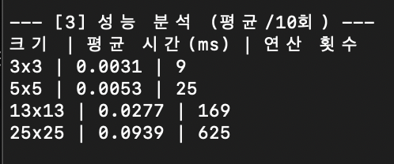

# Mini NPU Simulator
<p>
   
   
   
</p>

## 1. 프로젝트 개요
- 본 프로젝트는 인공지능 연산의 핵심인 **MAC(Multiply-Accumulate)** 연산을 구현한 시뮬레이터입니다.
- 2차원 배열 구조로 NPU의 특징 추출 과정을 재현합니다.
- 대규모 데이터 처리 시 발생하는 성능 변화를 분석하고, 실수 연산의 정밀도 한계를 극복하기 위한 예외 처리(Epsilon)를 중점적으로 다룹니다.

<br>

## 2. 실행 환경 및 실행 방법
- **실행 환경**: Python 3.12.13 / Git 2.53.0
- **제약**: 표준 라이브러리만 활용
- **실행 방법**:
```bash
git clone https://github.com/js910/Codyssey-Assignments
cd Codyssey-Assignments/Assignment-3-NPU
python main.py
```
- **메뉴 구성**:
    - `1`: 사용자 직접 입력 모드 (3x3 필터 및 패턴)
    - `2`: `data.json` 기반 자동 분석 및 성능 측정 모드
    - `3`: 프로그램 종료

<br>

## 3. 구현 요약
<p>
  
  
</p>

- **MAC 엔진**: 이중 반복문을 통해 요소별 곱셈 후 누적 합산을 수행하는 순수 파이썬 로직 구현
- **검증 시스템**: 입력 데이터의 행/열 개수를 연산 전 검사('all()' 함수 활용)하여 인덱스 에러 방지
- **자동 리포트**: 테스트 결과 요약(PASS/FAIL) 및 크기별 평균 연산 시간 자동 산출

<br>

## 4. 핵심 원리

### 1) 위 프로그램에서 MAC(Multiply-Accumulate) 연산이란?
- **개요**: 두 배열을 겹쳐 같은 위치의 숫자끼리 곱하고, 그 결과를 모두 더하는 연산입니다. 
- **AI에서의 중요성**: 딥러닝 모델은 수억 번의 MAC 연산을 통해 이미지의 선, 면, 모양 특징을 추출합니다. CPU의 직렬 처리로는 이 속도를 감당하기 어려워, 수천 개의 MAC 연산을 동시에(병렬) 처리하는 **NPU(Neural Processing Unit)**가 탄생했습니다.
- **점수 계산 원리**: 입력 패턴과 필터가 일치할수록 곱셈의 합(유사도 점수)이 높게 나타납니다.

### 2) 데이터 규칙 및 라벨 정규화
- **키 규칙 해석**: 'data.json'의 패턴 키('size_N_idx')에서 크기 정보 'N'을 추출해 해당 크기의 필터와 매칭합니다.
- **정규화 이유**: 데이터 제공처마다 정답을 '+', 'cross', 'x', 'X' 등 서로 다르게 표기할 수 있습니다. 이를 내부 표준인 'Cross'와 'X'로 통일해야 정확한 비교 판정이 가능합니다.

### 3) 부동소수점 오차와 허용오차(Epsilon)
- **오차 발생 원인**: 컴퓨터는 실수를 2진수로 표현하는 과정에서 미세한 오차가 발생합니다. (예: 0.1 + 0.2 != 0.3)
- **Epsilon 정책**: 'abs(score_a - score_b) < 1e-9' 조건을 적용하여, 아주 미세한 수치 차이는 동점으로 간주함으로써 연산 정확도의 한계를 극복합니다.

<br>

## 5. 결과 리포트

### 1) 실패(FAIL) 케이스 원인 분석
> 

1. **데이터/스키마 문제**: 'size_3_2' 패턴과 같이 행/열 개수가 일치하지 않는 케이스입니다. 이를 사전에 검증하여 시스템 중단 없이 해당 케이스만 필터링해 FAIL 처리하도록 설계하였습니다.
2. **로직 문제**: 'size_3_1' 패턴과 같이 특정 패턴의 모양이 정답 라벨('expected')과 실제 연산 결과가 일치하지 않는 경우입니다. 이는 ai에서 모델의 판정 정확도를 검증하는 지표로 사용됩니다.
3. **수치 비교 문제**: 'size_13_1' 패턴과 같이 미세한 점수 차이로 인해 발생하는 동점 처리(Fail) 입니다. $10^{-9}$ 보다 작은 점수 차이 발생시 변별력이 없다고 판단해 동점 처리했습니다.

### 2) 성능 표 해석
> 

- 시간 복잡도가 O(N^2)임을 확인함.
- 배열 크기 확장 시, 실행 시간이 증가하는 수치를 통해 병렬 연산 구조의 필요성을 확인함.

### 3) 시간 복잡도 근거 분석
- MAC 연산은 'N'개의 행과 'N'개의 열을 가진 2차원 배열 전체를 훑어야 하므로 **이중 루프**가 필수적입니다.
- 측정 데이터의 신뢰성을 높이기 위해 모든 연산은 패턴별로 10회 반복 측정 후 전체 평균을 산출하였습니다.
- 전체 연산 횟수는 패턴의 가로/세로 길이의 제곱('N^2')에 정비례하게 됩니다.
- 실제 측정 결과에서도 'N'이 커질수록 시간이 제곱에 비례하여 늘어나는 것을 확인할 수 있으며, 시간 복잡도는 **O(N^2)** 이 됩니다.